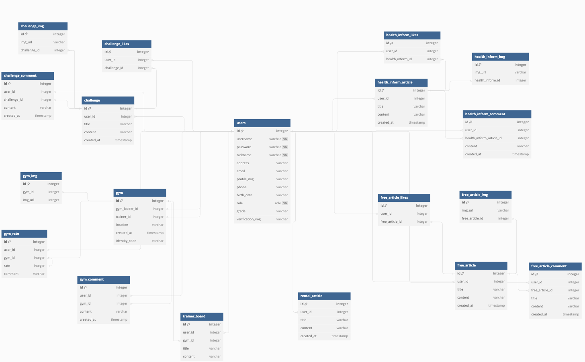

# Health Community

 

## 1. 프로젝트 소개

### 1️⃣ 프로젝트 기간
23.08.09 ~ 23.09.14

### 2️⃣ 프로젝트 설명
지역 헬스장 정보를 제공하고, 회원 간에 소통 할 수 있는 커뮤니티 제공

### 3️⃣ 개발환경 및 사용기술
- `java version 17`
- `Spring Boot 3.1.2`
- `MySQL`
- `IntelliJ IDEA Ultimate`
- `Spring Security`
- `JWT token`
- `Spring Data JPA`
- `Docker`
- `AWS EC2`
- `HTML`
- `Java Script`
- `CSS`

---

## 2. 팀원 담당 역할
### 팀장 배제우
- 프로젝트 전반적인 구조 설계
- 로그인/회원가입 기능 구현
- JWT 토큰 방식의 로그인 기능 구현
- 지도 API를 활용한 헬스장 등록 기능 구현
- CRUD 구현
- AWS 서버 구축
- GitHub Actions와 AWS CodeDeploy를 이용한 CI/CD 환경 구축

### 팀원 양예찬
- ERD 설계
- 데이터베이스 구축
- 로그인/회원가입 기능 구현
- 유저 등급 제도 구현
- CRUD 구현
- AWS 서버 구축
- GitHub Actions와 AWS CodeDeploy를 이용한 CI/CD 환경 구축

### 팀원 김태환
- 메인페이지, 로그인/회원 가입 프론트 구현

### 팀원 권길남
- AWS 서버 구축
- GitHub Actions와 AWS CodeDeploy를 이용한 CI/CD 환경 구축

---

## 3. ERD

---

## 4. 배포 구조도

---

## 5. 주요 기능
### 1️⃣ 회원가입
- 아이디, 비밀번호, 이름, 휴대폰 번호, 이메일, 닉네임을 입력하고 이메일 인증 후 가입하기 버튼을 누르면 회원가입
- 아이디, 닉네임 중복 검사 / 비밀번호, 휴대폰 번호, 이메일 유효성 검사

### 2️⃣ 로그인
- 인증 - JWT 토큰 : Access Token / Refresh Token
- 아이디와 비밀번호가 일치하는지 확인 후 AccessToken과 RefreshToken 생성 및 발급
- 토큰 검증 후 유효시간 지났을 경우 RefreshToken으로 AccessToken 재발급 + RefreshToken 재발급 (RTR)
- 아이디 찾기
- 비밀번호 찾기 - 임시 비밀번호 이메일로 발급
- 로그아웃 - DB와 쿠키의 RefreshToken 삭제
- 인가 - 토큰 검증 후 권한 부여

### 3️⃣ 커뮤니티
- 게시글 등록 - 로그인한 사용자에 한해 카테고리 선택, 제목, 이미지, 내용 작성
- 게시글 수정 - 해당 게시글 작성자에 한해 카테고리 변경, 제목 변경, 이미지 변경(추가, 삭제 가능), 내용 변경
- 게시글 삭제 - 해당 게시글 작성자에 한해 Delete
- 댓글 등록 - 로그인한 사용자에 한해 내용 작성
- 댓글 수정 - 해당 댓글 작성자에 한해 내용 변경
- 댓글 삭제 - 해당 댓글 작성자에 한해 Delete
- 조회수
- 좋아요 - 로그인한 사용자에 한해 게시글 좋아요 가능, 버튼 다시 누르면 좋아요 취소
- 카테고리 별 게시글 목록 조회
- 검색 필터[제목, 내용, 작성자], 키워드로 게시글 검색

### 4️⃣ 헬스장 정보 서비스
- 헬스장 등록 - 인가 받은 헬스장 사업자의 헬스장 정보 등록
- 게시글 등록 - 로그인한 사용자에 한해 헬스장 후기, 별점 등록

### 5️⃣ 마이페이지
- 프로필
    아이디, 이름, 닉네임, 이메일, 휴대폰 번호, 주소 등 본인이 회원가입시 등록했던 정보 조회
    비밀번호, 주소를 비롯한 개인 정보 변경
    좋아요 수에 따른 등급 부여

### 6️⃣ 메인 화면
